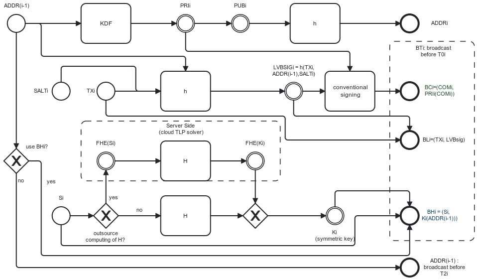

# LVBsig Lamport-Scheme-Based Signature for Bitcoin Layer 1

We propose a hybrid-key signature scheme consisting of a conventional signing scheme with irrepudiable signature and [Lamport scheme](https://en.wikipedia.org/wiki/S/KEY). The benefit of it is a significant reduction of onchain footprint as will be demonstrated below.

## Diagram

## Notation

* **TLP(.)** = Time-Lock Puzzle serial-work- and memory-hard hash, fully homomorphic under FHE(.);
* **h(.)** = nonspecific representation of conventional hashes;
* **FHE(.)** = Fully Homomorphic Encryption through a certain symmetric key of unique use;
* **KDF(.)** = conventional key deriving function;
* **PUBi** = public key correspondent to PRI_i;
* **PRIi** = KDF(ADDR_(i-1)) = conventional Bitcoin signing key;
* **PRIi(.)** = signature scheme having PRIi as signing key;
* **ADDRi** = h(PUB_i) = i-th Bitcoin address of the chain;
* **Si** = seed for derivation of through TLP Ki;
* **Ki** = symmetric encryption key;
* **Ki(.)** = symmetric encryption having Ki as key;
* **TXi** = plaintext transaction that empties ADDRi, the address it refers to. ADDR(i-1) can be used for exchange address, which would be for free in on-chain footprint, because exactly ADDR(i-1) will have to be published later for the validation of TXi. In case i = 1, such an option is not available;
* **SALTi** = Contacenation of nonces of a few blocks recent by the time of issuing of TXi, say T0i-6, ... Ti-13. Exact specification is yet to be deliberated, but clearly using recent blocks' nonces as salt is perfectly valid, and creates no footprint overhead;
* **LSIGi** = h(TXi,ADDR(i-1),SALTi);
* **COMi** = "commitment" = Smart contract stating "Miner of BLi gets F0i+FF0i. This transaction is not minable before (T2i-T0i) after Bli is mined."
* **F0i** = fee offered to mine BLi;
* **FF0i** = fine offered to miner of BL to compensate for delay (case B) or punishment for attempted double spend (case C);
* **F1i** = fee offered to mine ADDR(i-1) // TO BE DELIBERATED: it could be better to just hardcode set F1i to always be equal F0i, therefore economizing space for it in the blockchain;
* **F2i** = fee offered to mine BC in case of default;
* **T0i** = Block height of mining of BT;
* **T1i** = Block height owner should aim at broadcasting ADDR(i-1), or expected derivation of Ki from S1i. T1i = T0i+1 to T0i+6 blocks. This is to protect owner from dissensus. Namely, revealing ADDR(i-1) in a block and have it utilized to forge transaction in a competing block of same height.
* **T2i** = Block height of expiration of commitment. T2i = T0i+24*6 = T0i+144 (that is 24 h worth of blocks). This is to protect user from execution of commitment due to innocent network unavailability, at the same time put an incentive on miners to solve time-lock-puzzle (deriving Ki from S1i) to have F1i payable now rather than F2i later;

## Protocol

1. Alice broadcasts BTi. Broadcasting more than one valid BTi would be futile because would be a transparent double-spending attempt;
2. Miner M0i includes BLi (but not BCi) in block of height T0i. TXi, contained in BLi, promises M0i F0i in fees, which is, however, not paid until steps 3 or 4 happen. M0i accepts to sell space in T0i for delayed payment because of commitment contained in BCi. Though the integrity of BLi is not demonstrable in BLi, but in BCi, M0i tampering BLi for any reason is futile because it would make F0i and FF0i irredeemable with no affect to Alice. In other words, M0i tampering TXi would just turn it into waste of block space;
3. A few blocks later, Alice broadcasts ADDR(i-1), which miner M1i includes in block of height T1i. That authenticates TXi by allowing the verification of LSIGi, conveied in BLi, mined but pending confirmation since T0i. Upon that happening, M0i finally gets F0i. Even if she doesn't, for whatever reason (possibly an adversary blocking her access to internet), miners can derive Ki from Si, conveyed in BHi. M1i, miner of T1i gets their prescribed F1i. Trying to use the, now published ADDR(i-1) or PRIi=KDF(ADDR(i-1)) to forge transactions or cotnracts would be futile because they would conflict with the few-blocks-deep TXi whose validation implies the revocation of (ADDR(i-1),ADDRi)) as a private-public key pair;
4. In case T2i is reached without broadcasting of ADDR(i-1), COMi becomes minable and is, therefore, mined. M2i, its miner gets F2i fees, and M0i gets F0i+FF0i (F0i for TXi and FF0i to compensate for mining of BL and for the delay in payment).

## Security Analysis

There are three possible cryptanalysis to ADDR(i-1) in my scheme:

1.  Crack it from ADDRi alone before T0i (to be precise, before publishing of BTi);
2.  From ADDRi and (TXi, LVBSIGi) after T0i-1 (to be precise, after publishing of BTi);
3.  Outmine the rest of mining community starting from a disadvantage of not less than (T1i-T0i-1) blocks after T1i (to be precise, at time of publishing of ADDR(i-1));

For 1: a pre-image problem for a function
f1: {a | a is in the format of an ADDR} -> {a | a is in the format of an ADDR}, 
having both domain and codomain be the set of bitarrays in the same format as ADDRs. Here, f1 is given by:
f1(a) = h(PUB_FROM_PRI(KDF(a))), where PUB_FROM_PRI(.) is the derivation of public correspondent to private one.

For 2: a pre-image problem for a function
f2_(TXi,SALTi): {a | a is in the format of an ADDR} -> {a | a is in the format of an ADDR} x {s | s is in the format of a LVBSIG}
having as domain the set of bitarrays in the same format as ADDRs and codomain, the Cartesian product of the set of bitarrays in the same format as ADDRs with the set of bit arrays with the same length as LSIG. Here, f2_(TX,ECCPUB,SALT) is given by:
f2_(TXi,SALTi)(a) = (h(PUB_FROM_PRI(KDF(a))),h(TXi,ADDR(i-1),SALTi))

It can be argued that problem 2 is actually harder because attacker also has to mach the already published PUBi. But even the current statement of the problem is already unfeasible, particularly considering the limitted window of time (of T2i-T0i block at best) for solving it.

For 3: Equivalente of a double-spending attack with, in the best case (for attacker), starting from not less than (T1i-T0i-1) blocks in disadvantage to the rest of mining community. In other words, attacker has to outmine the rest of the community for at least (T1i-T0i-1) blocks to 'unbury' (TXi,LVBSIGi), and substitute it for a forged transaction.

## Multi Use

Protocol clearly can be set to allow N usages, where N gives the total iterations of the Lamport chain. Through address reuse is generally discouraged for anonymity purposes, often time the opposite of anonymity, namely, the public biding between a name and a key, is desired. For cases like that, in particular, an additional economy is possible because of the coincidence of ADDR(i-1) of both Lamport pre-image and exchange address.

## Footprint Analysis

In addition to TXi, the on-chain footprint of a single transaction includes:

* **LVBSIGi**: that can be safely set as **16 bytes**, considering the abundance of recent, high-quality salting given by SALTi;
* **ADDR(i-1)**: that is, for now, suggested to be **20 bytes**. We note that in case of reuse of address, this same piece of information is (and must be) economized in its plain form in TXi, in which case, the footprint falls to **0 bytes**.
